# Everything about USB

The following notes have been derived from articles from [www.circuitbread.com](https://www.circuitbread.com/tutorials)

## What is USB ?
- Universal Serial Bus is an asynchronous, serial bus protocol designed around master-slave architecture

- Only one host can exist in the system, and all communication with devices is initiated by the host only.

- The host allows up to 127 connections, which is limited by the 7-bit address supported by the USB protocol.

- USB follows a star-tiered topology, the bus can only allow a maximum of seven tiers to ensure that the USB device even in the lowest tier can communicate within the maximum tolerable propagation delay defined as per the USB specification.

## What pins it have?

-   **D+ and D-**: 
    -   The D+ and D- are the data lines that function at 3.3V and use a differential transmission with non-return-to-zero inverted (NRZI) encoded with bit stuffing. 
    -   The benefits of using differential signaling is that these signals are not susceptible to electromagnetic interference from surrounding appliances.
    -   They also do not emit any electromagnetic radiation that can potentially affect the surrounding electronic devices

-   **Vbus**: VBUS wire gives a constant supply voltage of 4.4 to 5.25 V to all the connected devices

-   **GND**: GND wire provides the ground voltage reference to the device.

## How signal flows?

- **Non-Return-To-Zero Inverted Space (NRZI-S) Encoding :**

    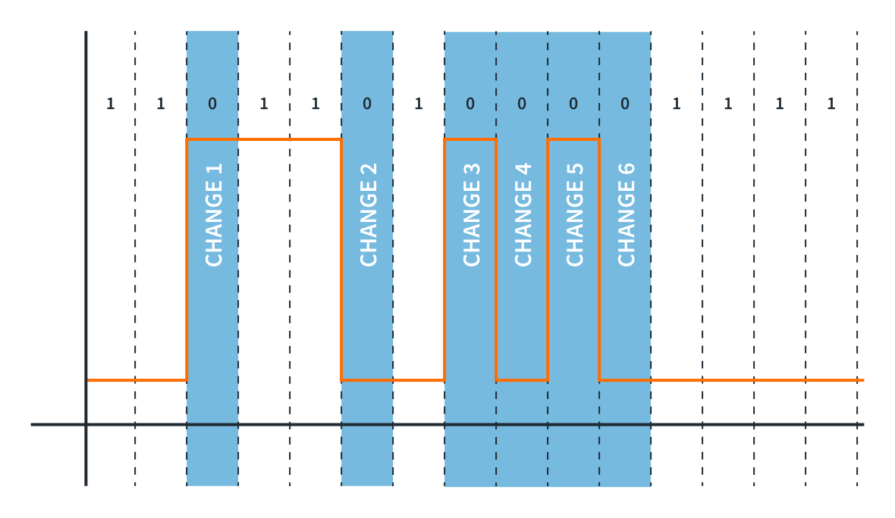

    The image is self explainatory

- **Bit stuffing :** 

    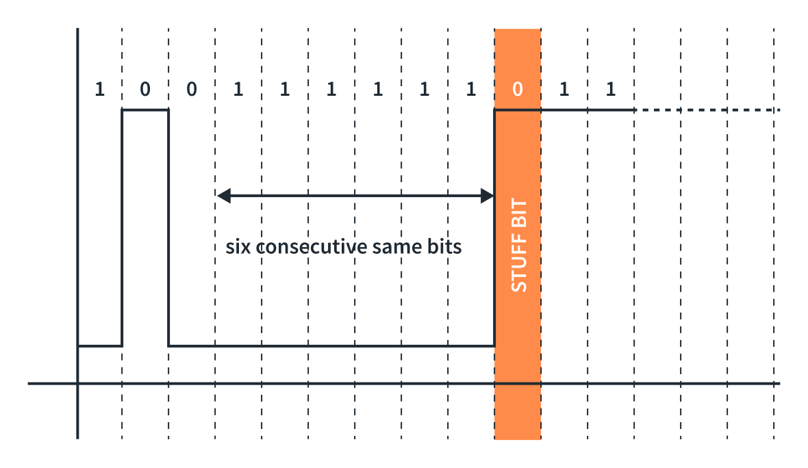

    -  If there is a long sequence of 1s, it might be difficult for the receiver to maintain accurate bit synchronization, leading to potential errors.
    
    - To resolve that, we need to insert a bit of opposite polarity after a set of N numbers of the same bits to maintain synchronization. In USB, bit stuffing is done by inserting a bit of the opposite value (0) after **six consecutive binary 1s**.

## How data transfers?

- **Data Transmission:**

    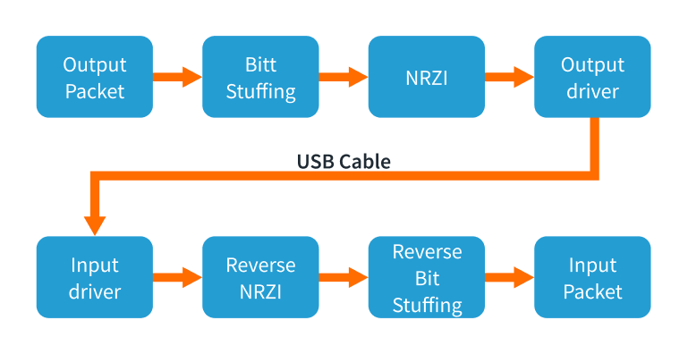
    
- **States:**

    - Differential 0 and Differential 1:
        - **Differential 1** is when the **D+ line is high** and the **D- line is low**. 
        - **Differential 0** is when the **D+ line is low** and the **D- line is high**.

    - J-State and K-State:
        - On a Full-Speed and High-Speed device : A **J-State** is a Differential **1**, and a **K-State** is a Differential **0**.
        - On a low-speed device (Opoosite of above) : A **J-State** is a Differential **0**, and a **K-State** is a Differential **1**.

    - Single-Ended Zero (SE0): when both D+ and D- are driven **low**.
    - Single-Ended One (SE1): when both D+ and D- are driven **High**.

    - Idle : 
        - On Full-Speed and High-Speed device : D+ being **High** and D- being **Low**.
        - on a low-Speed device : D+ being **low** and D- being **high** 

    - Start of Packet (SOP): Occurs before the start of any **Low-Speed** or **Full-Speed** packet when the D+ and D- lines transition from an **idle state to a K-State**.

    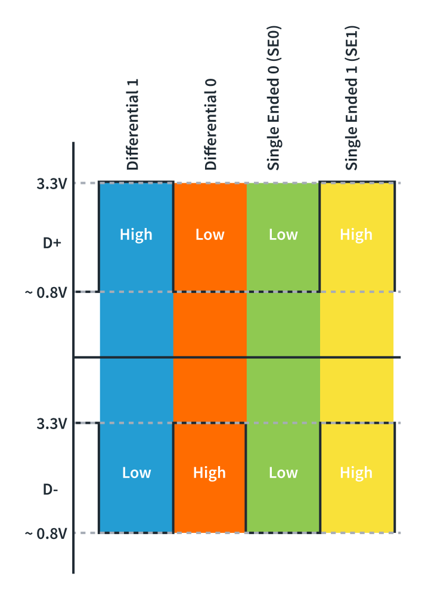

## What is speed of data transfer?

- **Low-Speed devices:**  
    - up to 1.5Mb/s
    - keyboards, mice, etc.
- **Full-Speed devices:**
    - up to 12Mb/s
    - mobile phones, audio
- **High-Speed devices:**
    - Up to 480 Mb/s
    - USB thumb drives, storage devices
- **Super-Speed and Super-Speed+ devices:**
    - USB 3.2 Gen 2x2 - up to 20Gb/s.
    - USB4 was introduced in 2019 -  20 Gb/s, optionally support 40 Gb/s and 80 Gb/s.

- **How it identify the device speed?**
    -  A **1.5kΩ pull-up** resistor on **D+ line** indicates the device is a **Full-Speed** device
    -  A **1.5kΩ pull-up** resistor on **D- line** indicates the device is a **Low-Speed** device.
    - For **High-Speed** device, check here [Dynamic Detection](#dynamic-detection)

# USB Protocol:

## USB Endpoints:

- A device endpoint is a uniquely addressable (at device level) portion of the device that can share information between the host and the device

- The endpoints are connected to the buffer of the host via pipes. Whereas, pipes are channels established between a specific endpoint on the USB device and the host controller.

- USB endpoints are unidirectional, and the data can only flow in the direction permitted by the endpoint. 

- They use cyclic redundancy checks (CRC) to detect errors in transactions.

- The USB specification has 32 endpoints consisting of 16 IN endpoints and 16 OUT endpoints.
    - IN - data flow from device to host.
    - OUT - data flow from host to device.

- To communicate initially, a special set of endpoints is used, which are known as Control Endpoint or Endpoint 0.

- This Endpoint 0 is defined as Endpoint 0 IN and Endpoint 0 OUT, and it doesn’t require a separate descriptor as it acts as a default endpoint for the host to communicate with the device. 

To cater the needs of different types of devices, USB specifications defines four types of transfers,

### 1. Control transfers endpoints

- All devices must support.

- They are bidirectional endpoints

- Need reserved bandwidth on bus
    - 10% - on LS and FS.
    - 20% on HS

- Purpose
    - USB system-level control.
    - The initial configuration and setup of the device. 
    - The device enumeration process.

### 2. Interrupt Endpoints

-  Support interrupt transfers, used in HID devices (ex : mice, keyboard)

-  It doesn’t truly support an interrupt mechanism rather it ensures that the host will use a polling rate i.e. the host checks for the data at a predictable interval. 

- Guaranteed bandwidth of 
    - 90% on LS and FS devices.
    - 80% on HS devices.

- The maximum packet size 
    - HS - 1024 bytes.
    - FS -  64 bytes.
    - LS -  8 bytes.

### 3. Bulk Endpoints
- Used in devices where a large amount of data is transferred.

- Supports error correction to guarantee accurancy, packets are re-sent on failure. This make delivery time variable.

- LS don't support bulk transfer.

### 4. Isochronous Endpoints

- Support continuous, real-time transfers with a pre-negotiated bandwidth. 

- Detect errors but are error-tolerant as they do not support error recovery mechanisms or handshaking.

-  guaranteed bandwidth of
    - 90% on LS and FS
    - 80% on HS

- Used in streaming applications.

## USB Communication

- USB 2.0 support **half duplex** communication.

- Data transferred as **LSB first**.

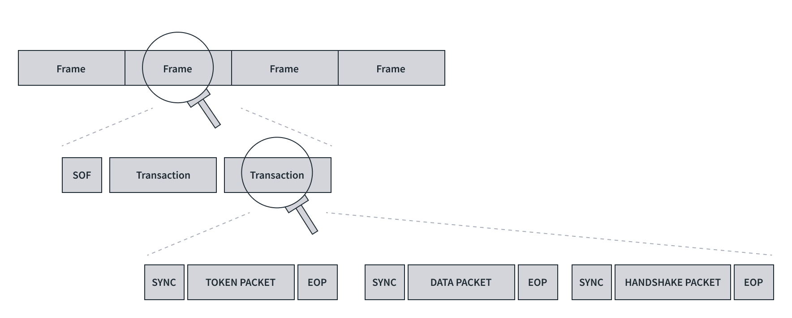

The figure is self explainatory.

### USB protocol from time perspective

- Series of **frames**.
- A frame consist Start of frame (SOF) + one or more **trasactions**.
- A transaction is a set of **token packet**, optional **data packet** and **handshake packet**.
- A packet contains,

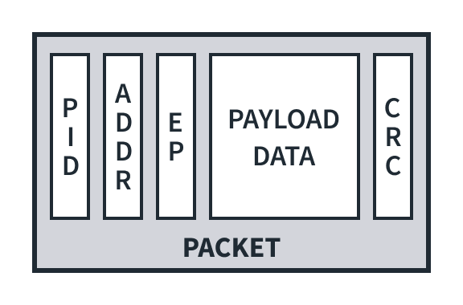

1. **PID - Packet ID** (8 bits)
    - To identify packet type
    - first 4 bits = type bits
    - last 4 bits = error check bits (complement of first 4 bits)
    -   Example -> 0001 1110
2. **Optional device address** (7 bits)
    - Address of device.
3. **Optional Endpoint address** (4 bits)
    - As per USB specification, it support up to 32 endpoint (16 IN and 16 OUT).
    - So, 4 bits support max up to 16 endpoints.
4. **Optional payload data** - (0 to 1023 bytes)
    - Actual chunk of data.
4. **Optional CRC** (5 or 16 bits)
    - 5 or 16 bits depending upon the CRC technique used ,i.e. CRC5 or CRC16.

### To start the transmission on the bus
1. **Transition** pattern (1 sate): Data lines of bus are 'transitioned' to K state.
2. **Sync** pattern (8 states): K J K J K J K K
3. **Actual** packet data : i.e PID + payload.
4. End of packet **EOP** : SE0 + SE0 + J state.

### Types of packets

**1. Tocken packets** = Device address (7bits) + endpoint ID (4 bits) + CRC (5 bits)

- Initiated by host, and used to direct the traffic on bus.
- It decide type of transaction between host and device.
- IN token packets
    - request the device for data. (data flow device -> host)
- OUT token packets
    - Notify the device host is ready to send data (data flow host -> device)
- SETUP token packets
    - Issued during setup and configuration of device.
- SOF toke packet
    -  issued to mark the start of a new frame

**2. Data packets** = packet ID + payload data + CRC16 
- Data packets support two types of packet IDs: DATA0 and DATA1. 
- The packet ID is toggled to its alternate state i.e. if DATA0 then the next packet will be DATA1 or vice versa.
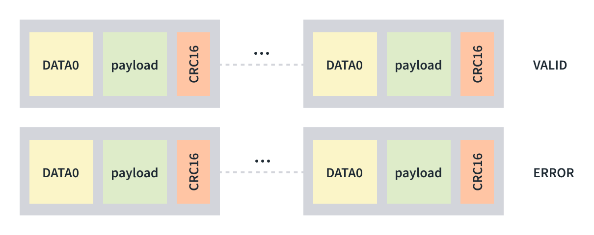

**3. Handshake packets** = 8 bit packet ID
- Used to conclude each transaction
- Sent by receiver of transaction
    - **ACK:** Acknowledge successful completion.
    - **NAK:** Negative acknowledgement.
    - **STALL:** Error indication sent by a device.
    - **NYET:** Indicates the device is not ready to receive another data packet. only supported on the High-Speed devices.

**4. Special packets**
- **PRE:** This is issued to hubs by the host to indicate that the next packet is low-speed when using Full- or High-Speed devices.
- **PING:** Only available on High-Speed devices, it is used to check the status of USB devices after receiving an NYET packet.

### Types of transactions

**1. Upstream Transactions** - (Upstream/Read/IN) From device to Host
- These transactions are initiated by the host to request the data from the device with an IN token packet.
- The device sends one or more data packets and the host responds with a handshake packet.
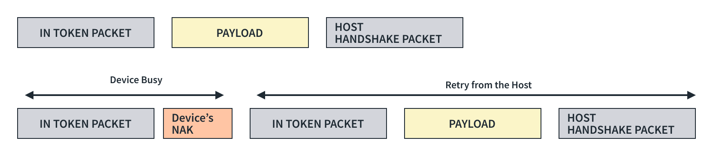

**2. Downstream Transactions** - (Downstream/Write/OUT) From Host to Device
-  These transactions are initiated by the host to send the data to the device with an OUT packet.
- The device responds with a handshake on the reception of the data.
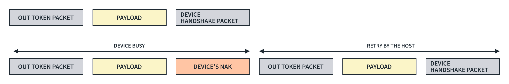

**3. Control Transactions** 
- Control transfers identify, configure, and control devices.
- Enable the host to,
    -  Read information about a device
    -   Set the device address.
    -   Establish configuration.
    -   Issue certain commands. 

- Control transfers have three stages: 
    1. The setup stage 
        -   This packet sends USB requests from the host to the device. The device always acknowledges the setup stage and cannot NAK it.
    2. The data stage
        -   This paclet is optional and required when a data payload is to be transferred between the host and the device.
    3. The status stage
        -   Includes a single IN or OUT transaction that reports on the success or failure of the previous stages.

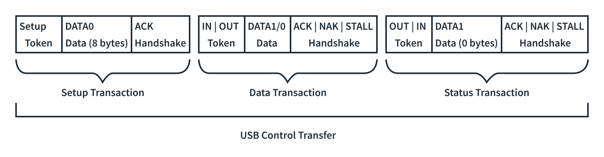

# USB Enumeration and configuration

we’ll understand the **USB descriptors** and their role in the process of enumeration and configuration, which makes a USB device hot-swappable, so without further due, let’s dive into it.

## USB Requests

To understand the USB descriptors first we need to have a good understanding of what USB requests are.

They are essentially just data packets sent from a host computer to a USB device to communicate with it.

1. Standard requests: 
    - These are defined by the USB specification and every device must understand them.
    - They perform essential tasks like getting device information, setting configurations, and checking status.

2. Class requests: 
    - These are specific to a particular device class (e.g., printers, storage devices) and defined by the relevant class specification.
    - They allow for more specific control over the device's functionalities.

3. Vendor requests: 
    - These are defined by the manufacturer of the device and allow for vendor-specific control and features.

## USB Descriptors

It is a small packet of information which act as an identity of the device.

Types,

### 1. Device Descriptor

When the device is plugged in, the first request the host makes from the device

|Offset	|Field	|Size (Bytes)	|Description|
|-------|-------|---------------|-----------|
|0|	bLength| 1	|The length of the descriptor is 18 bytes.|
|1|	bDescriptorType|	1	|The descriptor type is DEVICE (01h)|
|2|	bcdUSB|	2	|USB specification version (BCD)|
|4|	bDeviceClass|	1	|Device Class|
|5|	bDeviceSubClass|	1	|Device subclass|
|6|	bDeviceProtocol|	1	|Device Protocol|
|7|	bMaxPacketSize0|	1	|Max Packet size for endpoint 0|
|8|	idVendor|	2	|Vendor ID|
|10| idProduct|	2	|Product ID|
|12| bcdDevice|	2	|Device release number (BCD)|
|14| iManfacturer|	1	|Index of manufacturer string|
|16| iSerialNumber|	1	|Index of the serial number string|
|17| bNumConfigurations|	1	|Number of configurations supported|

### 2. Configuration descriptior

provides essential information about a specific configuration of a USB device. 

It outlines how the device is organized and how it interacts with the host system.

|Offset	|Field	|Size (Bytes)	|Description|
|-------|-------|---------------|-----------|
|0|	bLength|	1	|The length of this descriptor is 9 bytes.|
|1|	bDescriptorType|	1	|The descriptor type CONFIGURATION (02h).|
|2|	wTotalLength|	2	|Total length, including interface and endpoint descriptors.|
|4|	bNumInterfaces|	1	|The number of interfaces in this configuration|
|5|	bConfigurationValue|	1	|Configuration value used by SET_CONFIGURATION to select this configuration|
|6|	iConfiguration|	1	|Index of string that describes this configuration|
|7|	bmAttributes|	1	|Bit 7: Reserved (set to 1)	
||||Bit 6: Self-powered	
||||Bit 5: Remote wakeup|
|8|	bMaxPower|	1	|Maximum power required for this configuration.|

### 3. Interface Association Descriptor (IAD)

The main purpose of IAD is to group multiple interfaces together into a single functional unit. 

This ensures that the host computer recognizes and interacts with them as a unified entity.

|Offset|	Field|	Size (Bytes)|	Description|
|-------|-------|---------------|-----------|
|0|	bLength|	1	|Description size in bytes|
|1|	bDescriptorType|	1	|Descriptor type = INTERFACE ASSOCIATION (0Bh)|
|2|	bFirstInterface|	1	|Number identifying the first interface associated with the function|
|3|	bInterfaceCount|	1	|The number of contiguous interfaces associated with the function|
|4|	bFunctionClass|	1	|Class code|
|5|	bFunctionSubClass|	1	|Subclass code|
|6|	bFunctionProtocol|	1	|Protocol code|
|7|	iFunction|	1	|Index of string descriptor for the function|

### 4. Interface Descriptor

It is a data structure that defines a collection of endpoints within a USB device.

Each interface represents a distinct function of the device.

The main purpose is to provide information about a specific interface to the host, including:
-   Class code (e.g., audio, HID, mass storage)
-   Endpoints (channels for data transfer)
-   Protocol used for communication
-   Alternate settings (different configurations for the same interface)

|Offset|	Field|	Size (Bytes)|	Description|
|-------|-------|---------------|-----------|
|0|	bLength|	1	|The length of this descriptor is 9 bytes|
|1|	bDescriptorType|	1	|Descriptor type = INTERFACE (04h)|
|2|	bInterfaceNumber|	1	|Zero based index of this interface|
|3|	bAlternateSetting|	1	|Alternate setting value|
|4|	bNumEndpoints|	1	|Number of endpoints used by this interface (not including EP0)|
|5|	bInterfaceClass|	1	|Interface class|
|6|	bInterfaceSubclass|	1	|Interface subclass|
|7|	bInterfaceProtocol|	1	|Interface protocol|
|8|	iInterface|	1	|Index to string describing this interface|

### 5. Endpoint Descriptor

 It tells the host computer how to communicate with that endpoint for data transfer.
 
 Each endpoint has a unique channel for data flow in a particular direction (either IN or OUT).

|Offset	|Field	|Size (Bytes)|	Description|
|-------|-------|---------------|-----------|
|0|	bLength|	1	|The length of this descriptor is 7 bytes|
|1|	bDescriptorType|	1	|The type of descriptor is ENDPOINT (05h)|
|2|	bEndpointAddress|	1	|Bit 3...0: The endpoint number	Bit 6...4: Reserved, reset to zero
||||Bit 7: Direction. Ignored for Control
||||0 = OUT endpoint
||||1 = IN endpoint|
|3|	bmAttributes|	1	|Bits 1..0: Transfer Type
||||00 = Control
||||01 = Isochronous
||||10 = Bulk
||||11 = Interrupt
||||If not an isochronous endpoint, bits 5...2 are reserved and must be set to zero.
||||If isochronous, they are defined as follows:
||||Bits 3..2: Synchronization Type
||||00 = No Synchronization
||||01 = Asynchronous
||||10 = Adaptive
||||11 = Synchronous
||||Bits 5..4: Usage Type
||||00 = Data endpoint
||||01 = Feedback endpoint
||||10 = Implicit feedback Data endpoint
||||11 = Reserved|
|4|	wMaxPacketSize|	2	|Maximum packet size for this endpoint|
|5|	bInterval|	1	|Polling interval in milliseconds for interrupt endpoints (1 for isochronous endpoints, ignored for control or bulk)|

### 6. String Descriptor

This descriptor provides human-readable text strings to describe various aspects of a USB device.

It is optional but recommended for user-friendliness and compatibility.

A string descriptor can have the following information:
1. Device name
2. Manufacturer name
3. Product name
4. Serial number
5. Interface name
6. Endpoint name
7. Configuration names

|Offset	|Field	|Size (Bytes)|	Description|
|-------|-------|---------------|-----------|
|0|	bLength|	1	|The length of this descriptor is 7 bytes|
|1|	bDescriptorType|	1	|The descriptor type is STRING (03h).|
|2|	bString	-or	wLangID|	Varies	|Unicode encoded text string -or LANGID code|

## USB Enumeration and Configuration
The magic of hot-pluggable USB devices is made possible by the three step process of

1. Dynamic Detection
2. Enumeration
3. Configuration

### Dynamic Detection

How it detect High-Speed devices?
1. the transition on the D+ and D- line of the port indictes a newly connected device and determines the speed of the device as discussed in the [USB speed section](#what-is-speed-of-data-transfer).

2. It resets the device by pulling both the D+ and D- lines of the port low. This is made possible by the D+ and D- lines on the port having pull-down resistors attached to them on the host’s side for more than 2.5 us, and the host controller holds this state for 10ms. 

3. During the reset state, a high-speed device issues a single K-state. A High-Speed hub detects this and responds with a series of “KJKJKJ” patterns. 

4. The device detects this pattern and removes its pull-up resistor from its D+ line. 

5. If this pattern is not returned from the hub, it means the hub doesn’t support High-Speed devices and the device operates on Full-Speed.

### Enumeration and Configuration

1. Once the host has the device speed information, it starts communicating with the device through the control endpoint (*EP0*) on the default address i.e., 00h.

2. The host sends a *GET_DESCRIPTOR* command to the device to get a device descriptor from the device, from which it determines the maximum packet size supported by endpoint zero from the eighth byte of the device descriptor (*bMaxPacketSize0*).

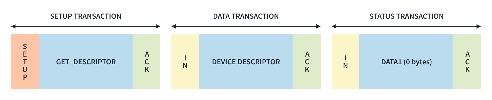

3. After getting the device descriptor, the host resets the device again and assigns a new address for the USB device by sending a *SET_ADDRESS* command to the the device using a control transaction. 

4. After the device returns from its reset, the host issues a command, GET_DESCRIPTOR, using the newly assigned address, to read the descriptors from the device.

5. After all descriptors are received, the host sets a specific device configuration using the *SET_CONFIGURATION* request and the host load a device driver. The host searches for a driver to manage communication between itself and the device. 

6. Windows machine use its .inf files to locate a match for the devices Product ID and Vendor ID.

7. The device is now in the configured state and the required power can be drawn from VBUS and is now ready for use in an application.

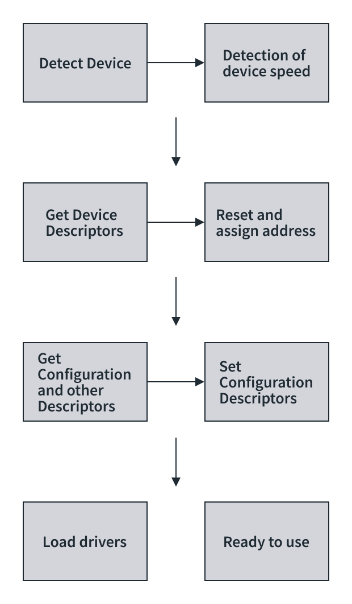

**❓Question :** If the maximum packet size for the control endpoint is not available beforehand, how did the host receive the device descriptor of 18 bytes? 

**💭 Answer :** Well, let’s suppose the maximum packet supported for the control endpoint is 8 bytes, then the device sends the descriptor into smaller chunks of 8-8-2 bytes, this is applicable to all types of descriptors.

## USB Classes

USB classes refer to different specifications or standards that define the capabilities and functionalities of USB devices and interfaces.

### 1. Standard classes

Standard classes are defined by official USB specifications and are intended for common device types. 

**1. USB Human Interface Device (HID) :** 

This class is used for devices such as keyboards, mice, game controllers, and joysticks. 

It allows these devices to be recognized by the operating system without needing additional drivers.

**2. USB Mass Storage :** 

Devices such as USB flash drives, external hard drives, and memory card readers fall under this class. 

They allow for easy storage and retrieval of data.

**3. USB Audio :** 

This class is used for audio devices such as speakers, microphones, headphones, and sound cards. 

It allows for the transmission of audio data over USB connections.

**4. USB Video :** 

Devices like webcams and digital cameras that capture or stream video use this class. 

USB video devices typically follow the USB video device class (UVC) standard.

**5. USB Printer :** 

Printers and multifunction devices that support printing, scanning, and faxing often adhere to the USB printer class specification.

**6. USB Communication Device Class (CDC) :** 

This class encompasses devices like modems, serial ports, and network adapters. 

It facilitates communication between devices and a host computer.

### 2. Vendor Specific Classes

Vendor-specific classes are are not part of the official USB specifications but are implemented by vendors to provide specialized functionalities or features unique to their products and allow manufacturers more flexibility in designing their devices.

These classes may require vendor-specific drivers or software to operate properly and may not be compatible with all operating systems or host devices.

